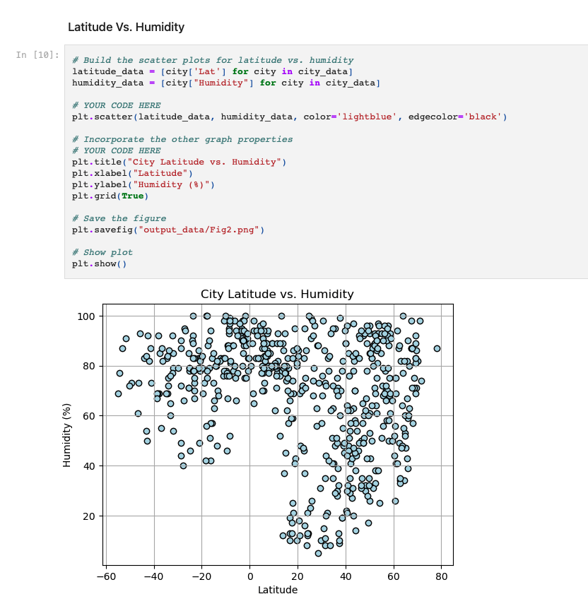

# python-api-challenge

In this assignment, I used an API key to get data from random cities and analayzed different weather patterns depending on their latitude. I also used an API key to to determine which cities were best for a vacation based on weather factors I manipulated. With that data, I created a map to display those cities with at least one hotel.

I used previous coursework and the Xpert Learning Assistant to assist me in this assignment.

